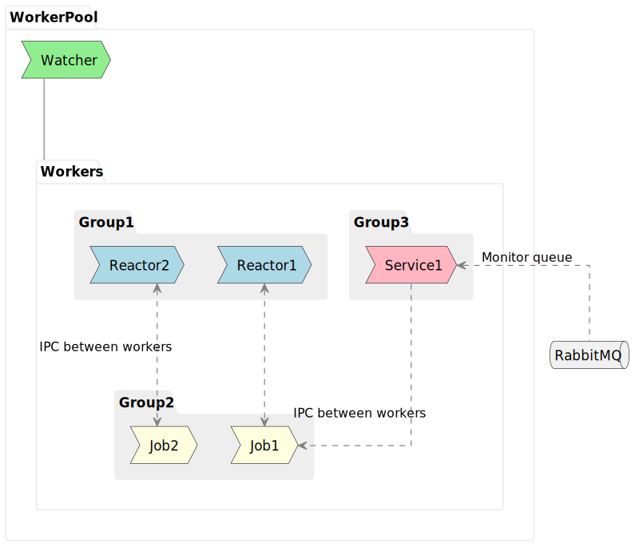
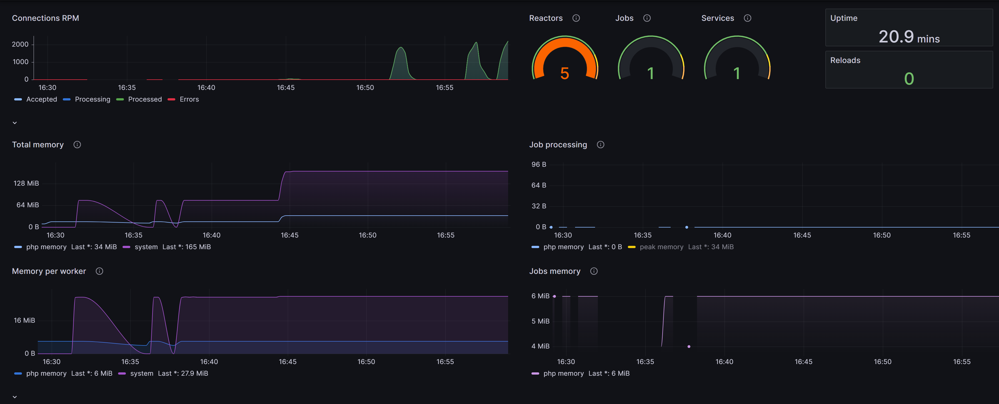

# AmPHP Pool [](https://github.com/EdmondDantes/amphp-pool/actions/workflows/php.yml)

Middle-level library for creating **Stateful** **Asynchronous** server-side applications
using the **pure PHP** and [AMPHP Library](https://github.com/amphp) 

* without *additional extensions* (such as `Swoole`)
* without auxiliary tools from *other* programming languages (such as `Go` + `Roadrunner`)

## Why is this needed?

* You want to use only pure PHP without additional extensions.
* You want to control how your Workers operate, 
and you want to be able to program their behavior to ensure a better balance of performance and stability.

## Features

* Workers for handling connections and background tasks (**jobs**), which are restarted and scaled on demand.
* Support for different `types` and `groups` of Workers with varying behaviors. 
* Strategies for `restarting`, `scaling`, and `pickuping` Workers for load distribution.
* Execution of **Jobs** based on `priority` and `weight` (*weight being an estimate of resource consumption*).
* `Coroutine Scheduler` for distributing a load among long-running background jobs.
* Support for telemetry and statistics with **Prometheus** + **Grafana**.
* Support for **Windows**.



## But isn't PHP slow?

Please review the [performance considerations](docs/01-performance-considerations.md).

## Installation

```bash
composer require ifcastle/amphp-pool
```

## Example

```php
<?php
declare(strict_types=1);

require_once __DIR__ . '/vendor/autoload.php';

use Amp\ByteStream;
use Amp\Log\ConsoleFormatter;
use Amp\Log\StreamHandler;
use IfCastle\AmpPool\WorkerGroup;
use IfCastle\AmpPool\WorkerPool;
use IfCastle\AmpPool\WorkerTypeEnum;
use Examples\HttpServer\HttpReactor;
use Monolog\Logger;
use Monolog\Processor\PsrLogMessageProcessor;

$logHandler = new StreamHandler(ByteStream\getStdout());
$logHandler->pushProcessor(new PsrLogMessageProcessor());
$logHandler->setFormatter(new ConsoleFormatter());

$logger = new Logger('server');
$logger->pushHandler($logHandler);
$logger->useLoggingLoopDetection(false);

// 1. Create a worker pool with a logger
$workerPool = new WorkerPool(logger: $logger);

// 2. Fill the worker pool with workers.
// We create a group of workers with the Reactor type, which are intended to handle incoming connections.
// The HttpReactor class is the entry point for the workers in this group.
// Please see the HttpReactor class for more details.
$workerPool->describeGroup(new WorkerGroup(
    entryPointClass: HttpReactor::class,
    workerType: WorkerTypeEnum::REACTOR,
    minWorkers: 1
));

// 3. Run the worker pool
// Start the main loop of the worker pool
// Now the server is ready to accept incoming connections.
// Try http://127.0.0.1:9095/ in your browser.
$workerPool->run();
```

Please also read the [Getting Started](docs/00-getting_started.md) guide.

## Prometheus + Grafana



Please see: [How to setup Grafana Dashboard](docs/00-getting_started.md#prometheus-metrics-and-grafana-dashboard)