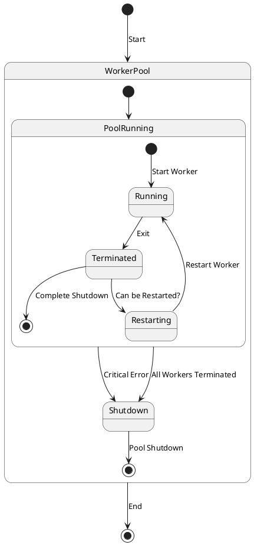

# Worker lifecycle

## Starting, restarting and stopping workers

The `WorkerPool` tracks the state of worker processes and, upon their termination, 
attempts to classify how the process was completed. 
By default, worker processes are automatically restarted if they are terminated. 
However, the final decision on whether to restart a worker depends on various factors.

To understand these factors, the `WorkerPool` uses a combination 
of indicators to determine the worker's termination state:

* Whether the worker process was terminated correctly, as required by the WorkerPool's flow.
* What caused the worker's termination.

`WorkerPool` and `worker processes` have an internal workflow and a clear sequence of actions for starting and stopping 
workers. If a worker violates this order for any reason, it is considered a critical state, 
and the `WorkerPool` may shutdown completely.

If the worker process is unexpectedly interrupted due to stack or memory issues or is killed by a user command like `kill`, 
the `WorkerPool` considers this an *unanticipated error*. 
In such cases, the `WorkerPool` intends to restore the worker's operation.

A worker process can also terminate voluntarily without the possibility of a restart. 
In this case, the `WorkerPool` does not attempt to restart the process 
and marks it as permanently terminated (until the entire application is restarted). 

## Scaling workers

Scaling is a way to dynamically adjust the number of Workers based on various factors. 
`WorkerPool` considers three key states of the Worker process regarding Scaling: 
* the worker will be started, 
* the worker will never be started, 
* and the worker is not yet working.

A `Watcher` process can receive a special `ScalingRequest` event, 
which prompts it to increase or decrease the number of active Workers in the group. 
This enables dynamic load adjustment on the server depending on a range of factors.

Note! For `UNIX` OS, the current implementation of the Reactor for `TCP/IP` does not support `Scaling`, 
due to the sharing socket algorithm used. Typically, this is not needed.

Generally, Scaling makes sense primarily for JOB-type Workers, 
although this approach has its drawbacks and should be used judiciously.

## Hard and Soft restart

`WorkerPool` supports both a **hard** and a **soft** restart of all Workers on demand.

A **hard** restart follows this sequence:

* First, all Workers terminate their work, and the Watcher process waits for completion.
* Then, the Watcher restarts all Workers.

A **soft** restart works differently: 
Each active Worker receives an event indicating it should restart as soon as possible **asynchronously**. 

Both restart methods can be useful during the deployment of your application.
The second method is generally preferred because the server continues to operate, 
seamlessly updating Workers for users. 
However, sometimes this is not possible due to the nature of changes in the code. 
A complete server restart may be necessary, as the interaction characteristics between Workers may change. 
In such cases, use the first method.