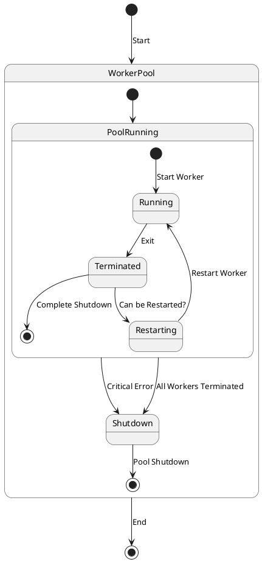

# Worker lifecycle

## Starting, restarting and stopping workers

The `WorkerPool` tracks the state of worker processes and, upon their termination, 
attempts to classify how the process was completed. 
By default, worker processes are automatically restarted if they are terminated. 
However, the final decision on whether to restart a worker depends on various factors.

To understand these factors, the `WorkerPool` uses a combination 
of indicators to determine the worker's termination state:

* Whether the worker process was terminated correctly, as required by the WorkerPool's flow.
* What caused the worker's termination.

`WorkerPool` and `worker processes` have an internal workflow and a clear sequence of actions for starting and stopping 
workers. If a worker violates this order for any reason, it is considered a critical state, 
and the `WorkerPool` may shutdown completely.

If the worker process is unexpectedly interrupted due to stack or memory issues or is killed by a user command like `kill`, 
the `WorkerPool` considers this an *unanticipated error*. 
In such cases, the `WorkerPool` intends to restore the worker's operation.

A worker process can also terminate voluntarily without the possibility of a restart. 
In this case, the `WorkerPool` does not attempt to restart the process 
and marks it as permanently terminated (until the entire application is restarted). 

## Scaling workers