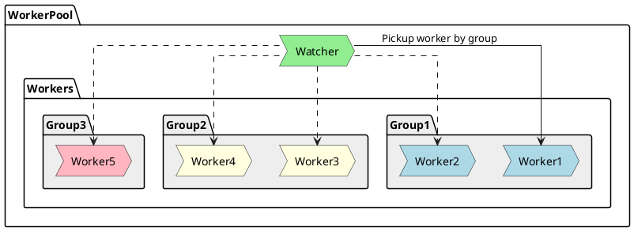
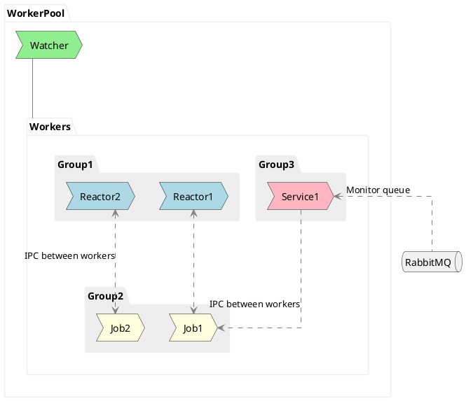

# Worker Pool architecture

`WorkerPool` consists of a `Watcher` process and `child processes` that are grouped together. 
`Groups` are needed to be able to address a specific group of processes and get the desired worker.

Worker groups enable the creation of various structural solutions suitable for different scenarios. For example, you can create two groups of Job workers: one for light tasks and another for heavy tasks. Different strategies for selecting workers can be used for different groups or types, and so on.

In addition to the `group number`, workers have a `type`, which can be:

* `Reactor` -- workers that handle external connections
* `Job` -- workers that process background tasks
* `Service` -- workers that perform some service (e.g., monitoring a RabbitMQ queue)

Different groups of Workers can communicate with each other through `IPC` according to the following rules:

* `Reactor` workers can send tasks to `Job` Workers.
* `Job` workers **cannot initiate communication** with `Reactors`.
* `Service` workers can receive requests from `Reactors`, and they can also send tasks to `Job` Workers.

## Watcher

The `Watcher` process is responsible for managing the `WorkerPool`.
It can start, stop, and restart workers, as well as monitor their health.
If a worker dies, the `Watcher` process can restart it.
